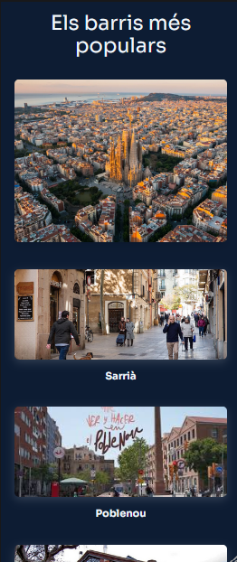
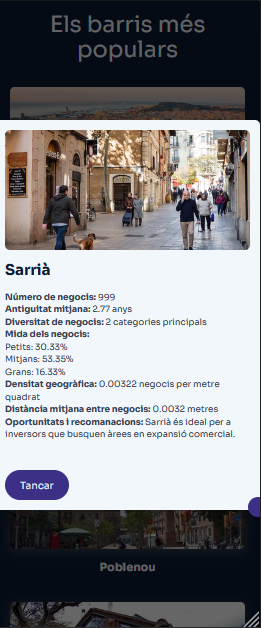
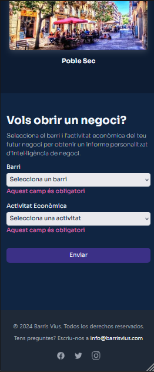
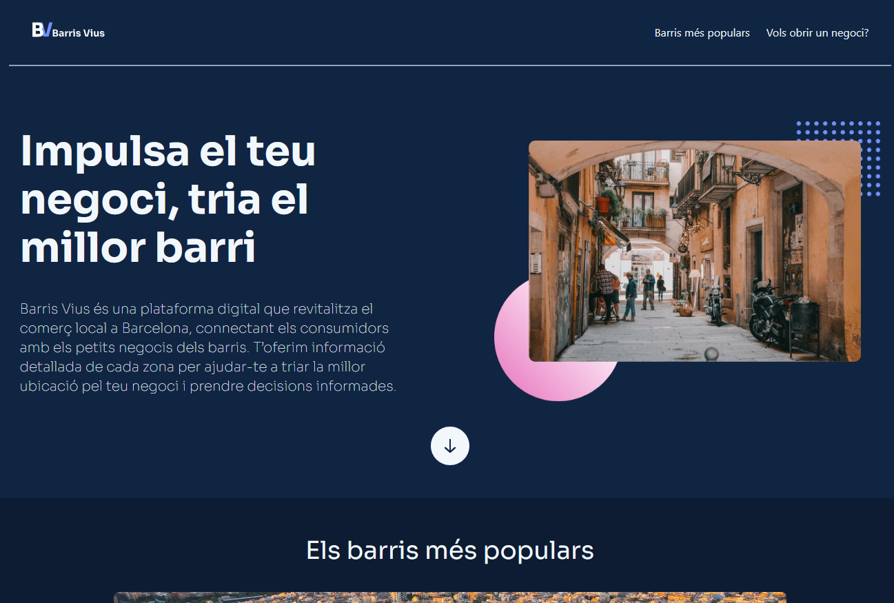
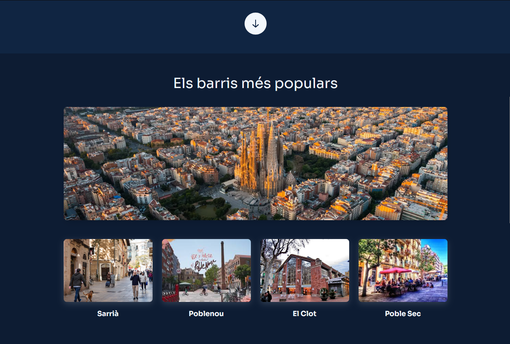
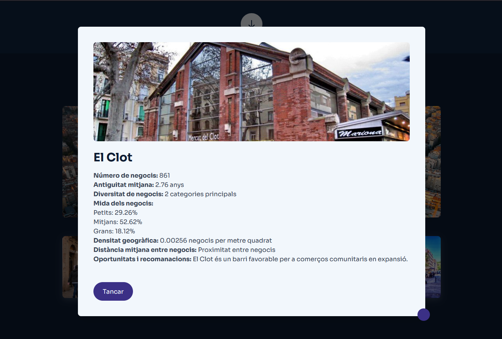
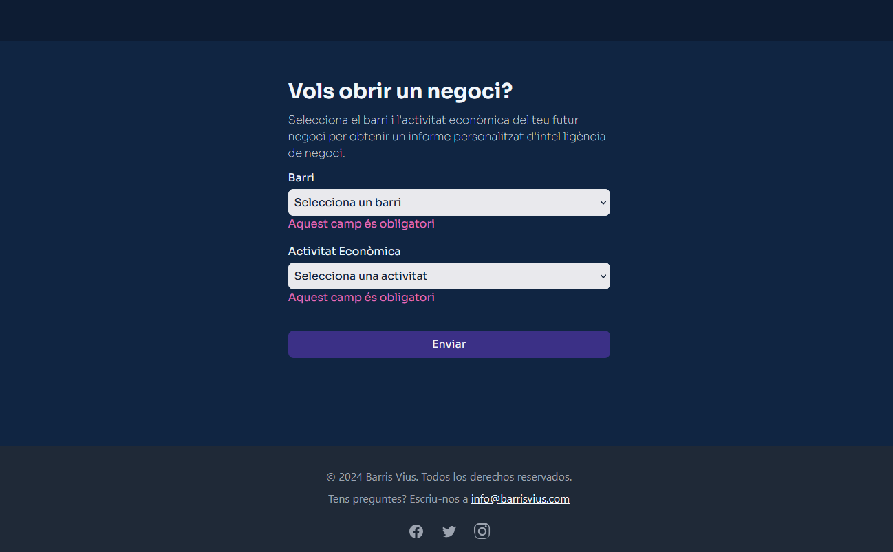

# 💻 Barris Vius

The platform provides essential commercial data to entrepreneurs, helping them identify the best areas to open new businesses. Users can access detailed information about the economic activity and commercial profile of each district in Barcelona, including business density, diversity of establishments, and the historical longevity of local shops. This data-driven approach offers valuable insights for business owners to make informed decisions and foster sustainable growth in the city's neighborhoods.

## 📋 Table of Contents
1. [Prerequisites](#-prerequisites)
2. [Installation](#-installation)
3. [Technologies Used](#-technologies-used)
4. [Starting the Project](#-starting-the-project)
5. [Features](#-features)
6. [Screenshots](#-screenshots)
7. [Presentation](#-presentation)
8. [Related Repositories](#related-repositories)
9. [Contributing](#-contributing)
10. [Contact](#-contact)


1. ## 🔧 Prerequisites

 [Node.js](https://nodejs.org/)

2. ## 🛠 Installation

**Clone this repository:** 

```bash
   git clone https://github.com/LauraGDev/comercio_local_front.git
```

 **Access the project:**

```bash
   cd comercio_local_front
```

 **Install the dependencies:**

```bash
   npm install
```

3. ## 📦Technologies Used
This project utilizes the following technologies:

- **React**: Library for building user interfaces.
- **TailwindCSS**: CSS framework for quickly styling the UI.

4. ## 🚀 Starting the Project

- **Development:**

```bash
   npm run dev
```
   Use this command to start the development server. The server will automatically reload 	when changes are detected in your code.

5. ## ✨ Features
   
- **Responsive Design**: The web app is designed to adapt smoothly to different screen sizes, providing a seamless experience across mobile, tablet, and desktop devices.
- **Initial Data Integration**: Currently, the app uses hardcoded data to showcase how information about and neighborhoods will be displayed.
- **Scalable Structure**: The project is structured to easily integrate live data and additional features in future development phases.

6. ## 🖼 Screenshots

### Mobile Screenshots






### Desktop Screenshots






7. ## 🎥 Presentation

Check out our project's presentation for a more detailed overview of the concept, design, and functionality.

[Click here to view the presentation](https://docs.google.com/presentation/d/1pLS9KXpcTahsZXFgFiSju9NGrxZGW4eN/edit?usp=sharing&ouid=107922569683596588419&rtpof=true&sd=true)


8. ## 📂 Related Repositories

In addition to the frontend repository, here are links to other parts of the project:

- [Backend Repository](https://github.com/AriRuizMartinez/Hackaton-Group-5)
- [Data Science Repository](https://github.com/tipping-points/data_science_comercio_local)


9. ## 🤝 Contributing

Contributions are more than welcome! If you have suggestions for improvements, new features, or if you spot any bugs, feel free to open an issue or submit a pull request.

### Steps to Contribute:
1. **Fork the Repository**
2. **Create your Feature Branch**
   ```bash
   git checkout -b feature/AmazingFeature


10. ### 🎉 That's all, folks!

Thanks for checking out this project! If you enjoyed it, feel free to give it a ⭐️ on GitHub and follow us for more awesome projects!

## 👥 The Team

### Backend:
- **[AriRuizMartinez](https://github.com/AriRuizMartinez)**
- **[Alalilacias](https://github.com/Alalilacias)**
- **[ChrisGalHur](https://github.com/ChrisGalHur)**

### Frontend:
- **[martinfrangul](https://github.com/martinfrangul)**
- **[LauraGDev](https://github.com/LauraGDev)**
- **[jess-ar](https://github.com/jess-ar)**

### Data Science:
- **[ibkbcn](https://github.com/ibkbcn)**
- **[sayo18](https://github.com/sayo18)**
- **[tipping-points](https://github.com/tipping-points)**


Have any questions or want to collaborate with us? we're excited to connect and work together as a team! ✨
